-   [Bayesian Problems:](#bayesian-problems)
    -   [Part A:](#part-a)
    -   [Part B.](#part-b.)
-   [Green Buildings](#green-buildings)
    -   [Outliers](#outliers)
    -   [Market rent of Green buildings Vs Non-Green buildings](#market-rent-of-green-buildings-vs-non-green-buildings)
    -   [Multiple Regression Model](#multiple-regression-model)
    -   [Economic Benefit Calculation](#economic-benefit-calculation)
-   [Portfolio Bootstrapping](#portfolio-bootstrapping)
-   [NutrientH20 Market Segmentation](#nutrienth20-market-segmentation)

Bayesian Problems:
------------------

### Part A:

RC = Random Choice Event

TC = True Choice Event

Y = "Yes" Choice Event

$N = "No" Choice Event$

#### Solve for *P*(*Y*/*T**C*)

*P*(*Y*/*T**C*)=*P*(*Y**n**T**C*)/*P*(*T**C*)

*P*(*T**C*)=.7

*P*(*Y**n**T**C*)=*P*(*Y*)−*P*(*Y**n**R**C*)

*P*(*Y*)=.65

*P*(*Y**n**R**C*)=*P*(*R**C*)\**P*(*Y*/*R**C*)

*P*(*R**C*)=.3

*P*(*Y*/*R**C*)=.5

P(Y n RC) =

``` r
YAndRC = .3 * .5
YAndRC
```

    ## [1] 0.15

P(Y n TC) =

``` r
YAndTC = .65 - YAndRC
YAndTC
```

    ## [1] 0.5

Finally,

P(Y/TC) =

``` r
YAndTC/.7
```

    ## [1] 0.7142857

### Part B.

*P* = *P**o**s**i**t**i**v**e**T**e**s**t**E**v**e**n**t* *D* = *H**a**s**D**i**s**e**a**s**e**E**v**e**n**t*

#### Solve for *P*(*D*/*P*)

*P*(*D*/*P*)=(*P*(*P*/*D*)\**P*(*D*))/*P*(*P*) *P*(*P*/*D*)=.993 *P*(*D*)=.000025 *P*(*P*)=*P*(*P**n**D*)+*P*(*P**n**D*<sup>*c*</sup>)

*P*(*P**n**D*)=*P*(*P*/*D*)\**P*(*D*)

``` r
PAndD = .993 * .000025
```

*P*(*P**n**D*<sup>*c*</sup>)=*P*(*P*/*D*<sup>*c*</sup>)\**P*(*D*<sup>*c*</sup>) *P*(*P*/*D*<sup>*c*</sup>)=(1 − .9999)

``` r
PAndNotD = (1-.9999) * (1-.000025)
```

``` r
P = PAndD + PAndNotD
```

$P(D / P) = $

``` r
print((.993 * .000025) / P)
```

    ## [1] 0.1988824

Yes. We foresee problems with universal testing. This test effectively has a 20% false positive rate. Yet, to determine whether or not to implement this policy, it is important to look at other factors, like the deadliness of the disease and the efficacy of early treatment.

Green Buildings
---------------

In this study, we evaluate the economic impact of "going green" on a latest project for an Austin real-estate developer. We consider the recommendations made by the developer's stats guru and establish whether or not he was right by doing some exploratory data analysis on the green buildings dataset.

### Outliers

One of the first assumptions made by the stats guru is that buildings which had very low occupancy rates are outliers and removing them from the dataset to avoid a potential distortion of the analysis.

Below is a histogram of the occupancy rates of the various buildings in the dataset. We can see that there's a considerable number of buildings with less than 10% occupancy rate, including some green buildings.

``` r
breaks = seq(0,100,10)
figure=ggplot()+ggtitle('Leasing Rate Histogram')+
       geom_histogram(data=green_buildings_not_green,aes(x= leasing_rate,fill='Non Green Buildings'),color='white',breaks=breaks)+
       geom_histogram(data=green_buildings_green,aes(x=leasing_rate,fill='Green Buildings'),color='black',breaks=breaks)+
       scale_x_continuous(breaks = breaks)+
  scale_fill_manual(name="Bar Color",
                    values=c('Non Green Buildings'='snow3', 'Green Buildings'='olivedrab4'),guide='legend')
figure
```

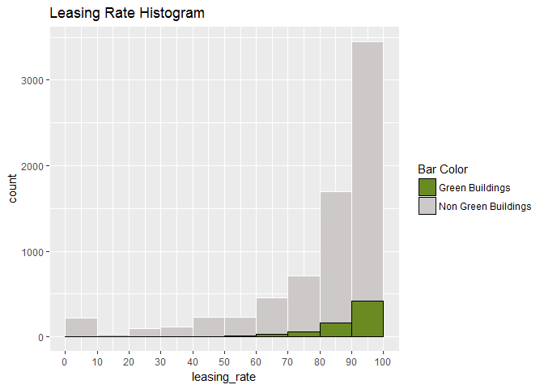

Our recommendation is to not exclude the buildings with less than 10% occupancy as they represent a non-negligible portion of the data. It is possible that our estimate of rents may get skewed if we eliminate this chunk of data.

### Market rent of Green buildings Vs Non-Green buildings

The stats guru looked at the green buildings and non-green buildings separately and calculated median market rents for both categories.Below is a histogram of the rents of all buildings.

``` r
green=median(green_buildings_green$Rent)
not=median(green_buildings_not_green$Rent)
figure=ggplot()+ ggtitle('Histogram of Rent')+
  geom_histogram(data=green_buildings_not_green, aes(x=Rent, fill='Non green buildings'))+
  geom_histogram(data=green_buildings_green,aes(x=Rent,fill='Green Buildings'))+geom_vline(aes(xintercept = not,color='Non green buildings median rent'))+geom_vline(aes(xintercept = green,color='Green buildings median rent'))+
  scale_fill_manual(name="Bar Color",
                      values=c('Non green buildings'='snow3', 'Green Buildings'='olivedrab4','Non green buildings median rent'='dimgray', 'Green buildings median rent'='darkseagreen2'),guide='legend')+
  scale_color_manual(name="Line Color",
                     values=c('Non green buildings median rent'='dimgray', 'Green buildings median rent'='darkseagreen2'),guide='legend')
figure
```

    ## `stat_bin()` using `bins = 30`. Pick better value with `binwidth`.
    ## `stat_bin()` using `bins = 30`. Pick better value with `binwidth`.

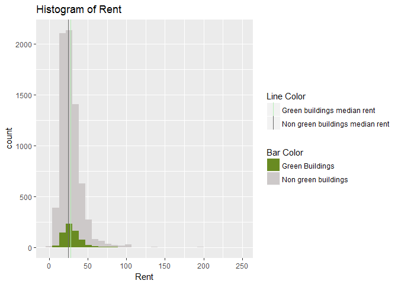

We can see that there are some outliers whose rent exceeds $125 per sq.ft. and he was right in calculating the median rent instead of mean as the median is more robust to outliers. But, we cannot conclude that green buildings fetch higher rent just by looking at the difference in median rents between green and non-green buildings.

For example, if we look at the median value of rents for green vs. non-green buildings which are between 240,000-260,000 sqft in size, we notice that median rent for green buildings is actually lower than non-green buildings by $2.06 per sq.ft.

``` r
green_buildings_25=subset(green_buildings_green, size<=260000 & size>=240000)
cat('Median value for green buildings in the 24k-26k sqft size range =',median(green_buildings_25$Rent))
```

    ## Median value for green buildings in the 24k-26k sqft size range = 25.35

``` r
green_buildings_25_not=subset(green_buildings_not_green, size<=260000 & size>=240000)
cat('Median value for non-green buildings in the 24k-26k sqft size range =',median(green_buildings_25_not$Rent))
```

    ## Median value for non-green buildings in the 24k-26k sqft size range = 27.41

The stats guru's analysis ignores the possibility of interactions between green rating of a building and the various other variables that also affect the rents of buildings like age, renovated, class of building quality etc. The fact that green buildings seem to have higher median rents only establishes correlation between rent and green rating. It does not establish causality. The scatter plots below can help illustrate this effect.

``` r
figure=ggplot()+ ggtitle('Rent Vs. Age')+
  geom_point(data=green_buildings_not_green, aes(y=Rent,x=age, color='Non green buildings'))+
  geom_point(data=green_buildings_green,aes(y=Rent,x=age,color='Green Buildings'))+
  scale_colour_manual(name="Dot Color",
                      values=c('Non green buildings'='snow3', 'Green Buildings'='olivedrab4'),guide='legend')
figure
```

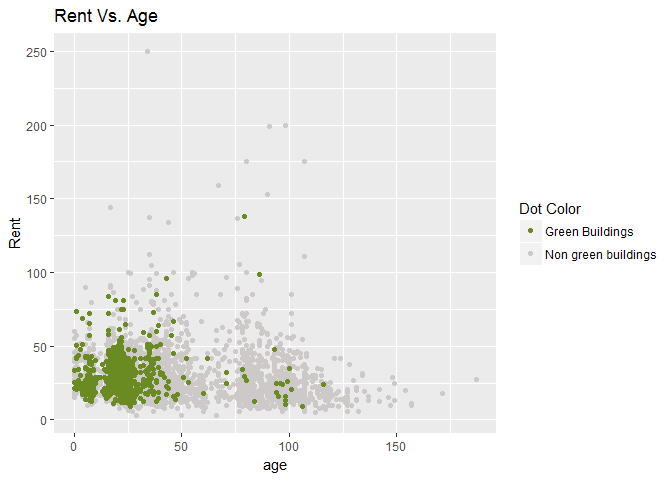

In the above scatter plot, we can see that the green buildings are clustered around low age, which is understandable since the concept of a 'green' building is relatively new. And we can also see that new buildings have slightly higher rents than the older buildings, if we ignore outliers. So, a portion of the high rents we see in green buildings is probably only because they are new and not because they are green.

We also observed that there is a high correlation between the construction class of buildings and the green rating. Close to 80% of the green buildings fall under class 'A'. Below chart shows a comparison of the median rent values by class and green rating. We see that class A buildings get higher rent than non-class A buildings. But there is no difference between the rents for a green vs. non-green class A building.

``` r
mediansGreen = green_buildings_green %>% group_by(class_a) %>% summarise(median = median(Rent))
```

    ## Warning: package 'bindrcpp' was built under R version 3.4.1

``` r
mediansNotGreen = green_buildings_not_green %>% group_by(class_a) %>% summarise(median = median(Rent))


medians = cbind(mediansGreen,mediansNotGreen)

colnames(medians) = c("class_a","Green Buildings","class_a","Non-Green Buildings")
medians = medians[,2:ncol(medians)]
medians = melt(medians,id = "class_a")
breaks=seq(0,1,1)
figure=ggplot(medians,aes(x = class_a,y = value,fill=variable)) + geom_col(position = "dodge")+ ggtitle('Class_A Vs. Median Rent')+
  scale_fill_manual(values=c("olivedrab4", "snow3")) + scale_x_discrete() + geom_text(x = 0,y = 26.5,label = "Not Class A") + geom_text(x = 1,y = 29.2,label = "Class A")+ylab('Median Rent')
figure
```

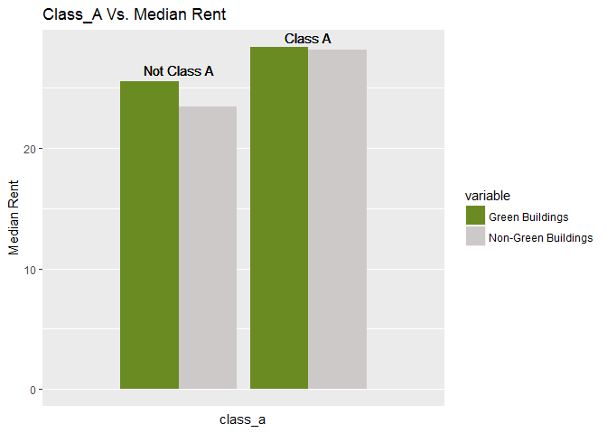

### Multiple Regression Model

To see the effect of green rating of a building on rents, we need to control for the other variables that are correlated with green rating. A multiple regression model of Rent on the factors can explain this. We dropped factors like cluster, LEED, Energystar and total\_dd\_07 from the linear model, because these variables do not add any extra information than what is already in the other variables.

``` r
fit_all=glm(Rent~.-cluster -LEED -Energystar -total_dd_07,data=green_buildings)
summary(fit_all)
```

    ## 
    ## Call:
    ## glm(formula = Rent ~ . - cluster - LEED - Energystar - total_dd_07, 
    ##     data = green_buildings)
    ## 
    ## Deviance Residuals: 
    ##     Min       1Q   Median       3Q      Max  
    ## -53.905   -3.591   -0.489    2.485  174.366  
    ## 
    ## Coefficients:
    ##                     Estimate Std. Error t value Pr(>|t|)    
    ## (Intercept)       -7.806e+00  9.971e-01  -7.828 5.59e-15 ***
    ## CS_PropertyID      3.116e-07  1.574e-07   1.979 0.047796 *  
    ## size               6.706e-06  6.554e-07  10.233  < 2e-16 ***
    ## empl_gr            6.413e-02  1.700e-02   3.772 0.000163 ***
    ## leasing_rate       9.626e-03  5.333e-03   1.805 0.071125 .  
    ## stories           -3.608e-02  1.617e-02  -2.232 0.025665 *  
    ## age               -1.307e-02  4.714e-03  -2.772 0.005586 ** 
    ## renovated         -1.504e-01  2.586e-01  -0.581 0.561001    
    ## class_a            2.866e+00  4.378e-01   6.547 6.26e-11 ***
    ## class_b            1.200e+00  3.428e-01   3.501 0.000467 ***
    ## green_rating       6.694e-01  3.979e-01   1.682 0.092547 .  
    ## net               -2.517e+00  5.929e-01  -4.245 2.21e-05 ***
    ## amenities          6.458e-01  2.517e-01   2.566 0.010303 *  
    ## cd_total_07       -1.409e-04  1.464e-04  -0.963 0.335612    
    ## hd_total07         5.272e-04  8.965e-05   5.881 4.25e-09 ***
    ## Precipitation      4.855e-02  1.611e-02   3.013 0.002595 ** 
    ## Gas_Costs         -3.738e+02  7.795e+01  -4.796 1.65e-06 ***
    ## Electricity_Costs  1.924e+02  2.488e+01   7.732 1.19e-14 ***
    ## cluster_rent       1.012e+00  1.415e-02  71.547  < 2e-16 ***
    ## ---
    ## Signif. codes:  0 '***' 0.001 '**' 0.01 '*' 0.05 '.' 0.1 ' ' 1
    ## 
    ## (Dispersion parameter for gaussian family taken to be 88.67231)
    ## 
    ##     Null deviance: 1783530  on 7819  degrees of freedom
    ## Residual deviance:  691733  on 7801  degrees of freedom
    ##   (74 observations deleted due to missingness)
    ## AIC: 57285
    ## 
    ## Number of Fisher Scoring iterations: 2

From the summary of the linear model fit, we can see that green rating of a building is not at all significant factor in determining the rent of the building.

The stats guru also assumed that the rent per sqft is not affected by the size of the building. He just calculated the median value of rents per sqft for all the buildings and multiplied the additional median value for green buildings with the square footage of the building. Below chart shows a plot of the Rent per sq.ft. for a building as a function of the total square footage of the building. We see that bigger buildings tend to have a higher per sq.ft rent. So, we would be able to get a realistic figure if we included the size of the building into our rent estimate.

``` r
figure=ggplot()+ggtitle('Rent Vs. Size')+
       geom_point(data=green_buildings_not_green,aes(y=Rent,x=size,color='Non_green_buildings'))+
       geom_point(data=green_buildings_green,aes(y=Rent,x=size,color='Green_buildings'))+
       scale_colour_manual(name="DotColor",values=c('Non_green_buildings'='snow3','Green_buildings'='olivedrab4'),guide='legend')
figure
```

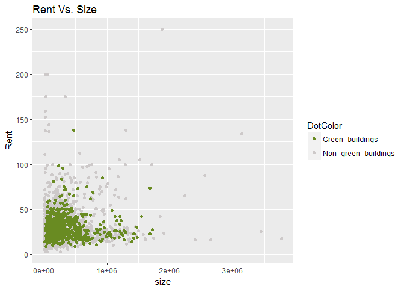

### Economic Benefit Calculation

According to the stats expert, "Our expected baseline construction costs are $100 million, with a 5% expected premium for green certification. Thus we should expect to spend an extra $5 million on the green building. Based on the extra revenue we would make, we would recuperate these costs in $5000000/650000 = 7.7 years. Even if our occupancy rate were only 90%, we would still recuperate the costs in a little over 8 years. Thus from year 9 onwards, we would be making an extra $650,000 per year in profit. Since the building will be earning rents for 30 years or more, it seems like a good financial move to build the green building."

The above calculation assumes that the rent earned on the building will not change as the building becomes older. Rent earned on a ten year old building will not be the same as the rent earned on a new building. The calculation does not also take into account the time value of money.

In conclusion, the stats "guru" overly simplified the problem at hand and ignored a lot of factors that affect the rent earned on a building. If we build in all of the relevant factors listed in the data set into our estimate of a building's rent, we will notice that a building's green rating is not a statistically significant factor in determining the rent earned on the building and will not on its own translate into any significant economic benefit to the real-estate developer.

Portfolio Bootstrapping
-----------------------

In this question we have explored below five asset classes:

-   US domestic equities (SPY: the S&P 500 stock index)
-   US Treasury bonds (TLT)
-   Investment-grade corporate bonds (LQD)
-   Emerging-market equities (EEM)
-   Real estate (VNQ)

We have taken our data from 2007-01-01. After exploring the data we created three portfolios for these assets assuming we have notional $100,000 to invest in one of these portfolios.

1.  First, we explored the properties of five assets we are considering.

Installing relevant libraries. *Quantmod* helps us to download several years of daily data on these ETFs.

Importing the stocks we are considering

Adjusting for splits and dividends

``` r
SPYa = adjustOHLC(SPY)
TLTa = adjustOHLC(TLT)
LQDa = adjustOHLC(LQD)
EEMa=adjustOHLC(EEM)
VNQa=adjustOHLC(VNQ)
```

Looking at close-to-close changes

``` r
par(bg = "gray")
plot(ClCl(TLTa),main = "US Treasury Daily Returns",ylab = "Return",col = "navy")
```

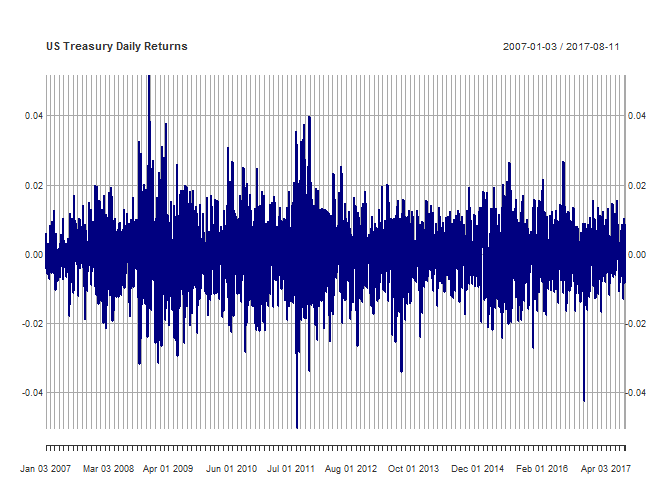

``` r
plot(ClCl(LQDa),main = "Investment Grade Corporate Bonds Daily Returns",ylab = "Return",col = "navy")
```

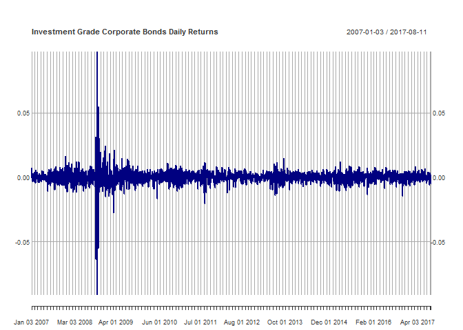

``` r
plot(ClCl(SPYa),main = "S&P 500 Daily Returns",ylab = "Return",col = "navy")
```

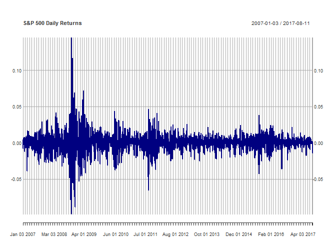

``` r
plot(ClCl(EEMa),main = "Emerging Market ETF Daily Returns",ylab = "Return",col = "navy")
```

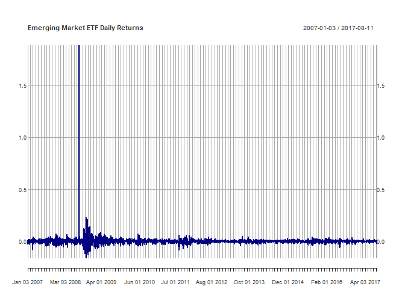

``` r
plot(ClCl(VNQa),main = "REIT Daily Returns",ylab = "Return",col = "navy")
```

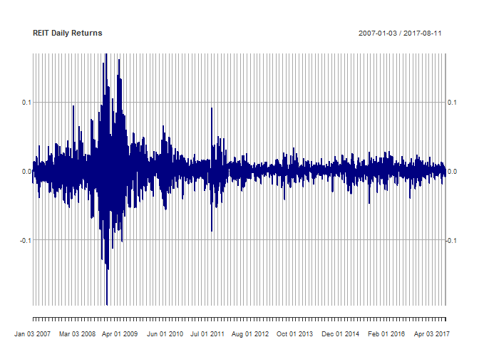

Combining close to close changes in a single matrix

``` r
all_returns = cbind(ClCl(SPYa),ClCl(TLTa),ClCl(LQDa),ClCl(EEMa),ClCl(VNQa))
all_returns = as.matrix(na.omit(all_returns))
```

We calculated the Sharpe ratio of individual stocks.

``` r
summary_stocks = cbind(t(t(colMeans(all_returns))),t(t(apply(all_returns,2,sd))))
summary_stocks = cbind(summary_stocks,summary_stocks[,1]/summary_stocks[,2])
colnames(summary_stocks) = c("Average Returns","ST.Dev of Returns","Sharpe Ratio")
summary_stocks
```

    ##           Average Returns ST.Dev of Returns Sharpe Ratio
    ## ClCl.SPYa    0.0003614205       0.012790205   0.02825760
    ## ClCl.TLTa    0.0003069034       0.009403909   0.03263573
    ## ClCl.LQDa    0.0002289702       0.005406605   0.04235008
    ## ClCl.EEMa    0.0010627256       0.041974329   0.02531846
    ## ClCl.VNQa    0.0004337976       0.021997783   0.01972006

These returns can be viewed as draws from the joint distribution

``` r
pairs(all_returns)
```


The correlation matrix between stocks

``` r
cor(all_returns)
```

    ##            ClCl.SPYa  ClCl.TLTa  ClCl.LQDa   ClCl.EEMa   ClCl.VNQa
    ## ClCl.SPYa  1.0000000 -0.4434811 0.10255294  0.40329628  0.77671377
    ## ClCl.TLTa -0.4434811  1.0000000 0.42152831 -0.16861612 -0.26520718
    ## ClCl.LQDa  0.1025529  0.4215283 1.00000000  0.08800942  0.06703847
    ## ClCl.EEMa  0.4032963 -0.1686161 0.08800942  1.00000000  0.29131651
    ## ClCl.VNQa  0.7767138 -0.2652072 0.06703847  0.29131651  1.00000000

1.  Now we are going to create our first portfolio with even split. We will assign the weight of each asset as 20%.

``` r
initial_wealth = 100000
set.rseed(1)    #Setting seed
sim1 = foreach(i=1:5000, .combine='rbind') %do% {
  total_wealth = initial_wealth
  weights = c(0.2, 0.2, 0.2, 0.2, 0.2)
  holdings = weights * total_wealth
  n_days = 20
  wealthtracker = rep(0, n_days)
  
  for(today in 1:n_days) {
    return.today = resample(all_returns, 1, orig.ids=FALSE)
    holdings = holdings + holdings*return.today
    total_wealth = sum(holdings)
    wealthtracker[today] = total_wealth
    #rebalance portfolio
    holdings = weights * total_wealth
  }
  wealthtracker
}

head(sim1)
```

    ##               [,1]      [,2]      [,3]      [,4]      [,5]      [,6]
    ## result.1  99141.37  99263.73  99466.67  99036.21  96466.62  96354.15
    ## result.2 100369.58 103260.91 103589.57 103444.70 102005.87 101863.51
    ## result.3 100104.94  99383.76  99303.45  99279.91  99589.12 100505.53
    ## result.4 100013.29 100086.54 100004.76 100870.79 101296.59 102987.05
    ## result.5  98369.74  98464.50  98654.64 100033.49 100019.04  98153.83
    ## result.6 100110.83  99884.16 100688.16 100691.16 100286.20  97900.06
    ##               [,7]      [,8]      [,9]     [,10]     [,11]     [,12]
    ## result.1  96293.03  96392.31  96085.93  97787.06  97814.82 103291.22
    ## result.2 101953.10 101337.12 101236.00  99800.07  99457.89  99181.49
    ## result.3 100592.05 100674.93 100372.13 100770.19 101039.05 101454.49
    ## result.4 103186.85 102716.34 104041.88 104674.66 104811.13 104706.75
    ## result.5  97784.21  98241.26  97865.67  96981.01  98745.60  99292.18
    ## result.6  98018.28  98389.59  98647.10  98949.20  99275.50  99929.97
    ##              [,13]     [,14]     [,15]     [,16]    [,17]    [,18]
    ## result.1 103539.38 103973.89 103602.92 103992.09 104456.2 104633.1
    ## result.2  99980.75  98312.26  98623.77  97676.09  97533.0  98080.6
    ## result.3 102821.23 102403.74 101676.01 101184.85 100850.5 102494.7
    ## result.4 105114.77 105642.23 105724.86 105964.99 106627.0 106850.2
    ## result.5 100125.69 100390.37 100123.51 100604.03 102797.7 102883.7
    ## result.6 100620.14 100717.76 100914.32 100548.25 100973.0 101258.9
    ##              [,19]     [,20]
    ## result.1 104758.56 104426.75
    ## result.2  97548.96  96850.92
    ## result.3 102188.99 103013.85
    ## result.4 106511.74 106886.51
    ## result.5 102786.33 103374.93
    ## result.6 101567.53 101137.30

Profit/loss of our portfolio:

``` r
par(bg = "gray")
mean(sim1[,n_days])
```

    ## [1] 100946.6

``` r
hist(sim1[,n_days]- initial_wealth, breaks=30,main = "Histogram of Portfolio Returns",xlab = "End of Period Return",ylab = "Frequency",col = "blue")
abline(v = mean(sim1[,n_days]) - initial_wealth,col = "red",lw = 3)
```

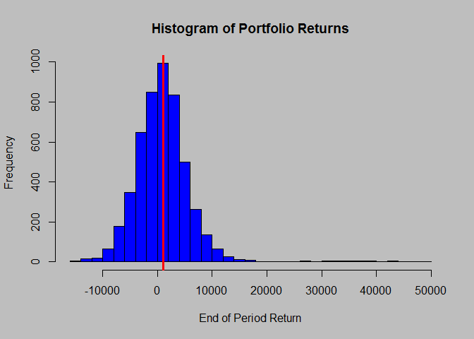

Calculating 5% value at risk for this portfolio

``` r
quantile(sim1[,n_days], 0.05) - initial_wealth
```

    ##        5% 
    ## -6297.993

Hence for this portfolio the average return is $100946.6 and value at risk is $6297.993

1.  Now we are going to create a safer portfolio which reduces our risk. To create this portfolio, we first calculated the average returns and risk involved with each asset had we invested all our wealth into that portfolio. Based on the results we tried different combinations and came up with weights which increased the return of portfolio and minimized the risk involved. Below are the weights: TLT - 20% LQD - 30% SPY - 50% EEM - 0% VMQ - 0%

``` r
initial_wealth = 100000
set.rseed(1)  #Setting seed
sim1 = foreach(i=1:5000, .combine='rbind') %do% {
  total_wealth = initial_wealth
  weights = c(.2, 0.3, 0.5, 0, 0)
  holdings = weights * total_wealth
  n_days = 20
  wealthtracker = rep(0, n_days)
  for(today in 1:n_days) {
    return.today = resample(all_returns, 1, orig.ids=FALSE)
    holdings = holdings + holdings*return.today
    total_wealth = sum(holdings)
    wealthtracker[today] = total_wealth
    weights = c(.2, 0.3, 0.5, 0, 0)
    holdings = weights * total_wealth
  }
  wealthtracker
}

head(sim1)
```

    ##               [,1]      [,2]      [,3]      [,4]      [,5]      [,6]
    ## result.1  99185.06  98890.33  98692.86  98361.51  97763.68  97327.92
    ## result.2 100233.02 100467.72 100473.54  99855.55 100159.71  99834.23
    ## result.3  99298.79  98363.78  97691.23  97620.56  97938.70  98889.54
    ## result.4  99908.02 100072.66  99563.90  99636.00 100189.37 100938.43
    ## result.5 100457.86 100522.19 100180.25 100450.24 100560.85  99594.87
    ## result.6 100345.59 100136.76 100550.14 100306.50  99776.89  99365.88
    ##               [,7]      [,8]      [,9]     [,10]     [,11]     [,12]
    ## result.1  97593.11  97662.42  97145.09  97224.97  97683.08  97864.64
    ## result.2 100219.03  99561.26  99450.41  99300.81  98945.41  98606.17
    ## result.3  98983.58  98671.12  98944.43  98963.77  99172.59  99861.18
    ## result.4 101098.50 100439.40 100626.29 101109.37 101647.95 101735.90
    ## result.5  99933.44 100336.21 100827.54  99773.80 100347.66 100716.32
    ## result.6  99468.56 100151.52 100295.32 100479.75 100548.86 101043.08
    ##              [,13]     [,14]     [,15]     [,16]     [,17]     [,18]
    ## result.1  98286.68  98549.56  98332.83  98087.53  98162.43  98218.64
    ## result.2  98838.81  98953.19  98687.99  98922.74  99397.98  99914.62
    ## result.3  99535.18  99397.92  99495.08  98642.37  98561.73  98655.90
    ## result.4 101238.62 101162.12 100838.24 101120.49 101438.50 101461.05
    ## result.5 101477.08 101543.28 101928.53 102407.98 102071.09 102026.55
    ## result.6 101126.44 101290.96 101924.56 102229.31 102309.54 101195.46
    ##              [,19]     [,20]
    ## result.1  98100.73  98081.27
    ## result.2  99166.19  99208.63
    ## result.3  98368.98  99053.02
    ## result.4 101440.93 101745.92
    ## result.5 102228.59 102369.25
    ## result.6 100440.93 100283.92

Profit/loss for this portfolio

``` r
par(bg = "gray")
mean(sim1[,n_days])
```

    ## [1] 100531

``` r
hist(sim1[,n_days]- initial_wealth, breaks=30,main = "Histogram of Portfolio Returns",xlab = "End of Period Return",ylab = "Frequency",col = "blue")
abline(v = mean(sim1[,n_days]) - initial_wealth,col = "red",lw = 3)
```

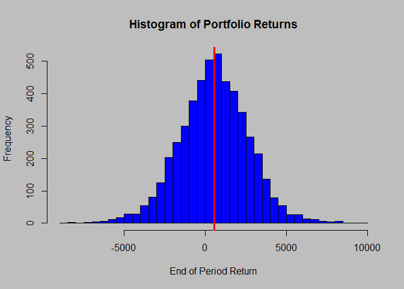

Calculating 5% value at risk

``` r
quantile(sim1[,n_days], 0.05) - initial_wealth
```

    ##        5% 
    ## -3066.526

Hence for this portfolio the average return is $100531 and value at risk is $3066.526

1.  Next we will create an aggressive portfolio which increases our return as well as our risk. After trying several combinations, below is the weight we considered for this portfolio:

TLT - 0% LQD - 0% SPY - 0% EEM - 90% VMQ - 10%

``` r
initial_wealth = 100000
set.rseed(1)      #Setting seed
sim1 = foreach(i=1:5000, .combine='rbind') %do% {
  total_wealth = initial_wealth
  weights = c(0, 0, 0, .9, .1)
  holdings = weights * total_wealth
  n_days = 20
  wealthtracker = rep(0, n_days)
  for(today in 1:n_days) {
    return.today = resample(all_returns, 1, orig.ids=FALSE)
    holdings = holdings + holdings*return.today
    total_wealth = sum(holdings)
    wealthtracker[today] = total_wealth
    weights = c(0, 0, 0, .9, .1)
    holdings = weights * total_wealth
  }
  wealthtracker
}

head(sim1)
```

    ##               [,1]      [,2]      [,3]      [,4]      [,5]      [,6]
    ## result.1  98849.46  99316.81 100344.38  99778.58  96816.88  97990.92
    ## result.2 100222.75 105840.87 106548.80 107458.07 102756.05 102665.58
    ## result.3 100960.61 100626.31 101618.01 101769.79 102213.01 103026.38
    ## result.4  99777.21  98764.71  99347.00 100628.95 101240.29 102831.28
    ## result.5  94999.27  95093.13  96112.75  98937.75  98287.70  97010.77
    ## result.6 100017.20 100243.22 101202.33 101666.61 101171.45  98324.65
    ##               [,7]      [,8]      [,9]     [,10]     [,11]     [,12]
    ## result.1  97828.95  97730.15  98200.52 102060.01 101894.26 115714.35
    ## result.2 102574.88 101565.88 101351.44  98190.64  98078.77  97314.78
    ## result.3 103558.54 104509.63 103595.21 104213.32 104427.68 103979.59
    ## result.4 103317.78 103086.51 106030.91 107679.60 107491.78 106605.83
    ## result.5  95325.67  96566.41  95383.97  94762.24  98144.91  98505.57
    ## result.6  98357.64  98070.82  98633.39  99326.23  99997.52 100829.78
    ##              [,13]     [,14]     [,15]     [,16]     [,17]     [,18]
    ## result.1 114279.59 114109.31 113304.93 114561.42 115954.25 116795.98
    ## result.2  98960.01  95261.54  96261.22  93658.21  92362.79  93459.23
    ## result.3 107516.79 106639.37 103681.39 105250.24 103600.38 107995.81
    ## result.4 107893.64 109307.91 110213.06 109917.64 111320.29 111973.50
    ## result.5  99457.48  99919.48  99291.34  99392.41 105301.22 106441.64
    ## result.6 102610.75 102699.67 101702.28 100867.45 101782.40 103576.16
    ##              [,19]     [,20]
    ## result.1 117894.50 117553.12
    ## result.2  93202.76  91252.38
    ## result.3 107626.48 108557.82
    ## result.4 111649.27 112737.39
    ## result.5 105619.92 107087.02
    ## result.6 106132.95 105162.60

Profit/loss for this portfolio

``` r
par(bg = "gray")
mean(sim1[,n_days])
```

    ## [1] 101872.8

``` r
hist(sim1[,n_days]- initial_wealth, breaks=70,main = "Histogram of Portfolio Returns",xlab = "End of Period Return",ylab = "Frequency",col = "blue")
abline(v = mean(sim1[,n_days]) - initial_wealth,col = "red",lw = 3)
```

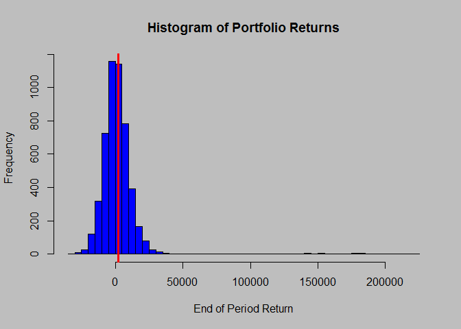

Calculating 5% value at risk

``` r
quantile(sim1[,n_days], 0.05) - initial_wealth
```

    ##        5% 
    ## -12925.12

Hence for this portfolio the average return is $101872.8 and value at risk is $12925.12

Below is the summary of our results:

Portfolio 1 (Even split): Mean Return - $100946.6 Value at Risk - $6297.993

Portfolio 2 (Safe): Mean Return - $100531 Value at Risk - $3066.526

Portfolio 3 (Risky): Mean Return $101872.8 Value at Risk - 12925.12

NutrientH20 Market Segmentation
-------------------------------

First, load the data.

``` r
df = read.csv("social_marketing.csv")
```

View a sample of the data:

``` r
head(df)
```

    ##           X chatter current_events travel photo_sharing uncategorized
    ## 1 hmjoe4g3k       2              0      2             2             2
    ## 2 clk1m5w8s       3              3      2             1             1
    ## 3 jcsovtak3       6              3      4             3             1
    ## 4 3oeb4hiln       1              5      2             2             0
    ## 5 fd75x1vgk       5              2      0             6             1
    ## 6 h6nvj91yp       6              4      2             7             0
    ##   tv_film sports_fandom politics food family home_and_garden music news
    ## 1       1             1        0    4      1               2     0    0
    ## 2       1             4        1    2      2               1     0    0
    ## 3       5             0        2    1      1               1     1    1
    ## 4       1             0        1    0      1               0     0    0
    ## 5       0             0        2    0      1               0     0    0
    ## 6       1             1        0    2      1               1     1    0
    ##   online_gaming shopping health_nutrition college_uni sports_playing
    ## 1             0        1               17           0              2
    ## 2             0        0                0           0              1
    ## 3             0        2                0           0              0
    ## 4             0        0                0           1              0
    ## 5             3        2                0           4              0
    ## 6             0        5                0           0              0
    ##   cooking eco computers business outdoors crafts automotive art religion
    ## 1       5   1         1        0        2      1          0   0        1
    ## 2       0   0         0        1        0      2          0   0        0
    ## 3       2   1         0        0        0      2          0   8        0
    ## 4       0   0         0        1        0      3          0   2        0
    ## 5       1   0         1        0        1      0          0   0        0
    ## 6       0   0         1        1        0      0          1   0        0
    ##   beauty parenting dating school personal_fitness fashion small_business
    ## 1      0         1      1      0               11       0              0
    ## 2      0         0      1      4                0       0              0
    ## 3      1         0      1      0                0       1              0
    ## 4      1         0      0      0                0       0              0
    ## 5      0         0      0      0                0       0              1
    ## 6      0         0      0      0                0       0              0
    ##   spam adult
    ## 1    0     0
    ## 2    0     0
    ## 3    0     0
    ## 4    0     0
    ## 5    0     0
    ## 6    0     0

Goal of Data Analysis: Find categories preferred by users so that NutrientH20 can tailor an appropriate marketing message.

Solution: Find the percentage of tweets per category, scale and find the most prominent clusters.

First, change the data frame total tweet numbers to fractions and drop the chatter column. We decided to drop the chatter column because of that column's inability to help shape our marketing message. Because a large number of tweets are characterized as "chatter", this would merely add noise to our clustering model and fail to provide interpret-able results.

``` r
df$X = NULL
df = data.frame(as.matrix(df)/rowSums(as.matrix(df)))
tempDf = df
#drop chatter 
tempDf$chatter= NULL
head(df)
```

    ##      chatter current_events     travel photo_sharing uncategorized
    ## 1 0.03278689     0.00000000 0.03278689    0.03278689    0.03278689
    ## 2 0.10000000     0.10000000 0.06666667    0.03333333    0.03333333
    ## 3 0.12765957     0.06382979 0.08510638    0.06382979    0.02127660
    ## 4 0.04761905     0.23809524 0.09523810    0.09523810    0.00000000
    ## 5 0.16666667     0.06666667 0.00000000    0.20000000    0.03333333
    ## 6 0.17647059     0.11764706 0.05882353    0.20588235    0.00000000
    ##      tv_film sports_fandom   politics       food     family
    ## 1 0.01639344    0.01639344 0.00000000 0.06557377 0.01639344
    ## 2 0.03333333    0.13333333 0.03333333 0.06666667 0.06666667
    ## 3 0.10638298    0.00000000 0.04255319 0.02127660 0.02127660
    ## 4 0.04761905    0.00000000 0.04761905 0.00000000 0.04761905
    ## 5 0.00000000    0.00000000 0.06666667 0.00000000 0.03333333
    ## 6 0.02941176    0.02941176 0.00000000 0.05882353 0.02941176
    ##   home_and_garden      music      news online_gaming   shopping
    ## 1      0.03278689 0.00000000 0.0000000           0.0 0.01639344
    ## 2      0.03333333 0.00000000 0.0000000           0.0 0.00000000
    ## 3      0.02127660 0.02127660 0.0212766           0.0 0.04255319
    ## 4      0.00000000 0.00000000 0.0000000           0.0 0.00000000
    ## 5      0.00000000 0.00000000 0.0000000           0.1 0.06666667
    ## 6      0.02941176 0.02941176 0.0000000           0.0 0.14705882
    ##   health_nutrition college_uni sports_playing    cooking        eco
    ## 1        0.2786885  0.00000000     0.03278689 0.08196721 0.01639344
    ## 2        0.0000000  0.00000000     0.03333333 0.00000000 0.00000000
    ## 3        0.0000000  0.00000000     0.00000000 0.04255319 0.02127660
    ## 4        0.0000000  0.04761905     0.00000000 0.00000000 0.00000000
    ## 5        0.0000000  0.13333333     0.00000000 0.03333333 0.00000000
    ## 6        0.0000000  0.00000000     0.00000000 0.00000000 0.00000000
    ##    computers   business   outdoors     crafts automotive       art
    ## 1 0.01639344 0.00000000 0.03278689 0.01639344 0.00000000 0.0000000
    ## 2 0.00000000 0.03333333 0.00000000 0.06666667 0.00000000 0.0000000
    ## 3 0.00000000 0.00000000 0.00000000 0.04255319 0.00000000 0.1702128
    ## 4 0.00000000 0.04761905 0.00000000 0.14285714 0.00000000 0.0952381
    ## 5 0.03333333 0.00000000 0.03333333 0.00000000 0.00000000 0.0000000
    ## 6 0.02941176 0.02941176 0.00000000 0.00000000 0.02941176 0.0000000
    ##     religion     beauty  parenting     dating    school personal_fitness
    ## 1 0.01639344 0.00000000 0.01639344 0.01639344 0.0000000        0.1803279
    ## 2 0.00000000 0.00000000 0.00000000 0.03333333 0.1333333        0.0000000
    ## 3 0.00000000 0.02127660 0.00000000 0.02127660 0.0000000        0.0000000
    ## 4 0.00000000 0.04761905 0.00000000 0.00000000 0.0000000        0.0000000
    ## 5 0.00000000 0.00000000 0.00000000 0.00000000 0.0000000        0.0000000
    ## 6 0.00000000 0.00000000 0.00000000 0.00000000 0.0000000        0.0000000
    ##     fashion small_business spam adult
    ## 1 0.0000000     0.00000000    0     0
    ## 2 0.0000000     0.00000000    0     0
    ## 3 0.0212766     0.00000000    0     0
    ## 4 0.0000000     0.00000000    0     0
    ## 5 0.0000000     0.03333333    0     0
    ## 6 0.0000000     0.00000000    0     0

Second, let's load the libraries required. This includes registering parallel computing.

Next, run a function *ClusterTweeters*. That function, given a K and a data frame will return the CH score of all that model. *withoutChatter* is a matrix with the CH score and SSE(tot) of all the models tested between k = 1 and k = 15. This step included **%dopar%** to tell the foreach loop to compute the results in parallel.

``` r
clusterTweeters = function(numK,df){
  model = LICORS::kmeanspp(as.matrix(df), k = numK,nstart = 10)
  #find ch value for the model
  c(clusterCrit::intCriteria(as.matrix(df),model$cluster,"Calinski_Harabasz"),model$tot.withinss)
}

withoutChatter = foreach(k = 1:15,.combine = 'rbind')%dopar%
{
  clusterTweeters(k,tempDf)
}
colnames(withoutChatter) = c('CH Score','Fit')
withoutChatter
```

    ##           CH Score Fit     
    ## result.1  1179.097 400.9804
    ## result.2  1179.097 400.9804
    ## result.3  974.6298 369.5526
    ## result.4  937.2596 339.7262
    ## result.5  922.9332 313.8751
    ## result.6  905.3025 292.7372
    ## result.7  861.3994 278.3183
    ## result.8  809.714  268.0368
    ## result.9  775.219  257.8584
    ## result.10 735.2165 250.4552
    ## result.11 697.3207 244.4301
    ## result.12 665.9535 238.7492
    ## result.13 637.5765 233.7286
    ## result.14 602.4883 231.0133
    ## result.15 576.6154 227.5166

``` r
par(bg = "gray")
plot(1:nrow(withoutChatter),withoutChatter[,2],col = "red",main = "Fit vs. K",type = "l",xlab = "K",ylab = "SSE (tot)")
```

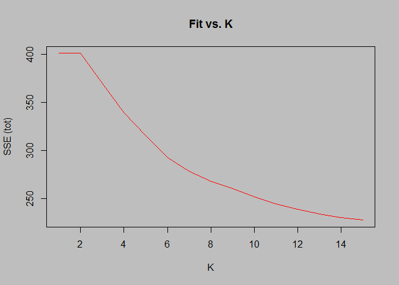 Using the elbow method, there is no clear shift in slope of the line as K increases. This curve looks closer to an exponential decay than an elbow. The elbow method, therefore, is not a good metric of choosing the optimal number of market segments. A heuristic such as CH score could find a better optimal K.

Let's plot the CH scores of all the models tested.

``` r
par(bg = "gray")
plot(1:nrow(withoutChatter),withoutChatter[,1],main = "K selections versus CH Score",xlab = "K",ylab = "CH Score",type = "l",col = "red")
abline(v = (which.max(withoutChatter)+1),col = "blue",lw = 2)
```

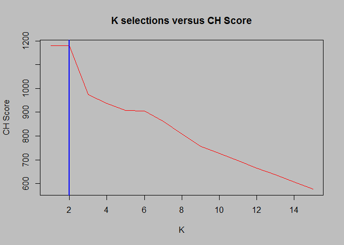 CH score indicates two optimal market segments. We believe that this is the best metric for determining the clusters because of the fit vs. simplicity trade off inherent within the heuristic and it's clear answer: two segments.

Next, let's analyze the important components of that each cluster. In other words, for each cluster's centriod, let's look for the centriod with the highest value.

``` r
optimalModel = LICORS::kmeanspp(tempDf, (which.max(withoutChatter)+1),nstart = 10)
#plot parameters for each model
topN = 5
centriodMat = matrix(NA,2,topN)
par(bg = "gray",mfrow = c(2,1))
for (k in 1:2)
{
  sorted = sort(optimalModel$centers[k,],decreasing = TRUE)[1:topN]
  barplot(sorted,ylim = c(0,.23),col = "blue",main = paste("Figure",k,":"))
  centriodMat[k,] = names(sorted)
}
```

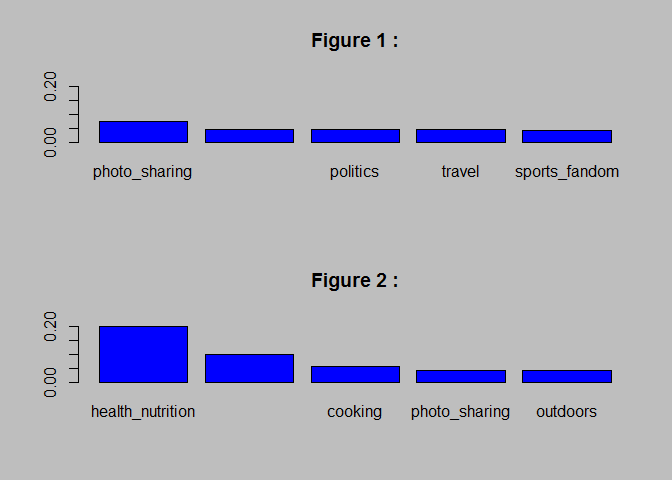

``` r
print(paste("Top",topN,"important centriod indicators per cluster: "))
```

    ## [1] "Top 5 important centriod indicators per cluster: "

``` r
print(centriodMat)
```

    ##      [,1]               [,2]               [,3]       [,4]           
    ## [1,] "photo_sharing"    "current_events"   "politics" "travel"       
    ## [2,] "health_nutrition" "personal_fitness" "cooking"  "photo_sharing"
    ##      [,5]           
    ## [1,] "sports_fandom"
    ## [2,] "outdoors"

The one of the clusters looks to be composed of people who are very conscious of their health. They seem to be focused on Personal Fitness and are interested in the outdoors. This indicates a very physically active group of people and would recommend that the marketing message ought to be related to personal health. This cluster contains this fraction of social media users:

``` r
length(which(optimalModel$cluster == 1))/length(optimalModel$cluster)
```

    ## [1] 0.7951028

The second cluster appears to be grouped for millennials. Politically engaged(current\_events and politics), educated (college\_uni) and active in photo sharing, this could be a young group of people. We would need to dig more into the profiles of this segment, but a marketing strategy focused on millennials could be appropriate. A visually appealing marketing campaign would be attractive to these social media followers.

This clusters contains this fraction of social media users:

``` r
length(which(optimalModel$cluster == 2))/length(optimalModel$cluster)
```

    ## [1] 0.2048972
